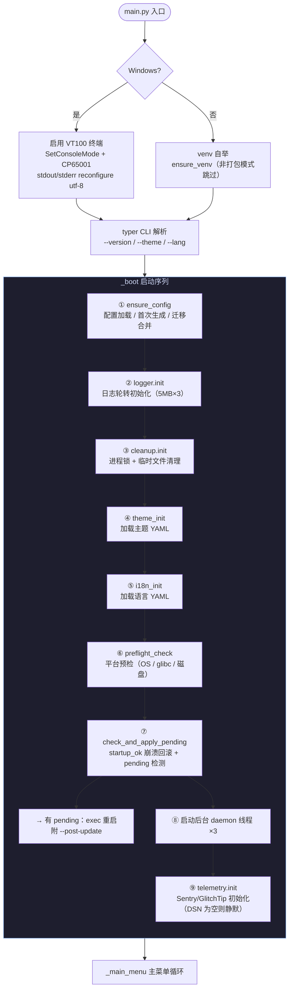
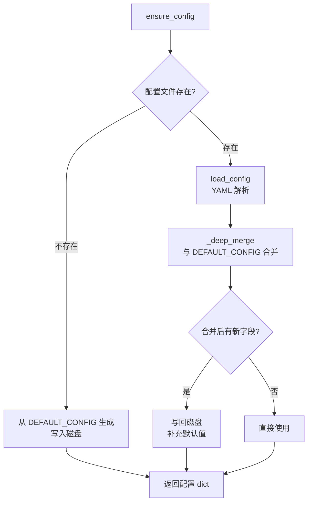
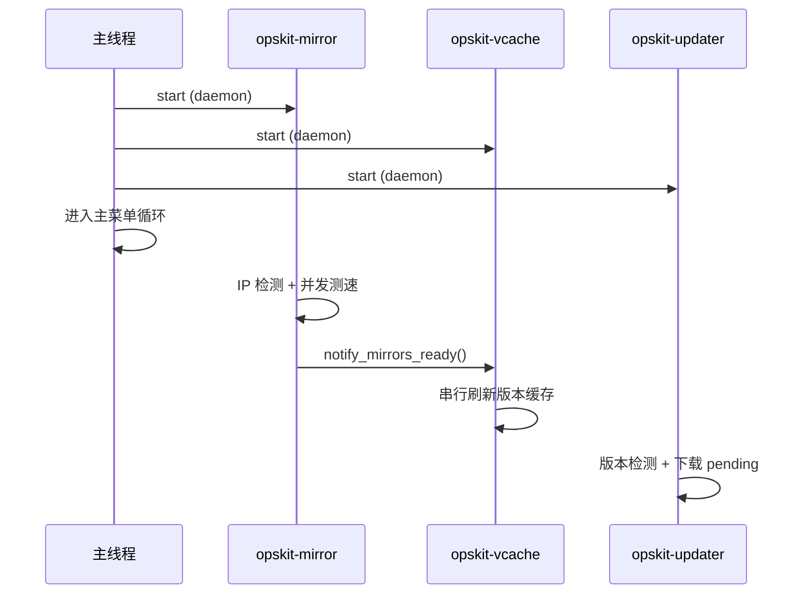

# 启动流程与配置管理设计

> 所属主流程：[overview.md](overview.md) → _boot 启动序列

---

## 1. 设计目标

- 首次运行零配置：自动生成默认配置文件
- 配置迁移只增不删：新版本添加字段不破坏用户自定义
- 双模式路径：开发时用项目目录，打包后用系统标准路径
- 启动序列严格有序，后台线程不阻塞 UI

---

## 2. 启动序列



### 每步职责

| 步骤 | 模块 | 职责 | 失败影响 |
|------|------|------|----------|
| venv | `core/venv_bootstrap.py` | Linux/macOS 非打包模式确保 venv 激活 | 回退系统 Python |
| ① | `core/config.py` | 读取/创建/迁移 `config/common.yaml` | 使用默认配置继续 |
| ② | `core/logger.py` | 初始化 RotatingFileHandler（5MB×3） | 日志不写入文件 |
| ③ | `core/cleanup.py` | 获取文件锁防多实例、清理过期缓存 | 可能多实例冲突 |
| ④ | `core/theme.py` | 加载 `catppuccin.yaml` | 使用硬编码默认色 |
| ⑤ | `core/i18n.py` | 加载 `zh.yaml` / `en.yaml` | 显示 key 而非翻译 |
| ⑥ | `core/platform.py` | 检测 glibc / arch / 磁盘空间 | 打印警告继续 |
| ⑦ | `core/updater.py` | `startup_ok` 崩溃回滚检测 + pending 二进制应用 | 静默跳过 |
| ⑧ | 多个 | 启动 mirror / vcache / updater daemon 线程 | 使用本地缓存/硬编码 |
| ⑨ | `core/telemetry/` | 初始化 Sentry provider，DSN 来自配置 | 静默降级为 NullProvider |

---

## 3. 配置管理

### 3.1 配置文件结构

```yaml
# config/common.yaml
language: auto          # zh / en / auto
theme: catppuccin       # 主题名

modules: {}             # 模块开关（空 = 全部启用）

update:                 # 自更新配置
  enabled: true
  channel: stable
  check_interval: 86400 # 默认 24h
  auto_apply: true
  repo: ougato/opskit-cli
  mirrors:
    - https://mirror.ghproxy.com/https://github.com/ougato/opskit-cli/releases/download
    - https://github.com/ougato/opskit-cli/releases/download

mirror:                 # 源管理配置
  region: auto          # cn / global / auto

wireguard:              # WireGuard 配置持久化
  domain: ""
  client:
    server_ip: ""
    reality_pub: ""
    wg_server_pub: ""
    uuid: ""
    short_id: ""

log:                    # 日志配置
  level: WARNING

telemetry:              # 错误上报（Sentry / GlitchTip）
  enabled: true
  dsn: "https://...@sentry.io/..."  # 留空则静默
```

### 3.2 配置加载流程



### 3.3 配置迁移

```python
def migrate_config(config, from_version, to_version):
    # 按版本链逐步迁移：v1 → v2 → v3
    # 迁移前自动备份原配置为 .bak
    # 迁移失败 → 使用默认配置 + 保留 .bak
    # 只增不删：绝不删除用户自定义字段
```

### 3.4 配置修改 API

```python
set_config_value(config, "update.enabled", False)
# 支持点号路径，自动创建中间层级
# 修改后立即写入磁盘
```

---

## 4. 路径双模式

### 4.1 数据目录

| 优先级 | 条件 | 路径 |
|--------|------|------|
| 1 | `OPSKIT_DATA_DIR` 环境变量 | 自定义路径 |
| 2 | 打包模式 + Linux | `/var/lib/opskit/` |
| 2 | 打包模式 + macOS | `~/Library/Application Support/opskit/` |
| 2 | 打包模式 + Windows | `C:\ProgramData\opskit\` |
| 3 | 开发模式 | 项目根目录（`main.py` 所在） |

### 4.2 资源目录

| 模式 | 路径来源 |
|------|----------|
| 开发 | `Path(__file__).parent.parent / relative` |
| PyInstaller | `sys._MEIPASS / relative` |
| Nuitka | `Path(sys.executable).parent / relative` |

### 4.3 目录布局

```
{data_dir}/
├── config/
│   └── common.yaml              # 用户配置（含 telemetry DSN / wireguard 参数）
├── cache/
│   ├── mirror_cache.yaml         # 源测速缓存（TTL=24h）
│   ├── version_cache.yaml        # 版本缓存（TTL=1h/24h）
│   ├── update_check.json         # 更新检测状态（last_check / pending_version / ETag）
│   ├── bootstrap_cache.json      # 动态源本地副本
│   ├── opskit.pending            # 待应用的新版本二进制
│   ├── opskit.pending.tmp        # 下载中间文件（完成后 rename 为 .pending）
│   ├── opskit_update.ps1         # Windows Rename-Then-Copy 延迟替换脚本
│   ├── startup_ok.json           # 崩溃回滚检测（记录上次成功启动的版本号）
│   └── update_pending_path.json  # Windows 四层兜底标记（下次启动再尝试）
├── backups/
│   └── opskit.v{N}.{ts}.bak     # 版本备份（时间戳命名，保留最近 3 个）
├── logs/
│   └── opskit.log               # 运行日志（5MB 轮转 ×3）
└── opskit.lock                  # 进程锁文件
```

---

## 5. 模块自动发现

### 5.1 开发模式

```python
def _discover_dev():
    # 扫描项目根目录下所有含 __init__.py 的子目录
    # 跳过 core / tests / .git / __pycache__ 等
    # 对每个目录调用 importlib.import_module(name)
    # 调用 module.register() 获取 ModuleInfo
```

### 5.2 打包模式

```python
def _discover_frozen():
    # 读取 _registry.py 静态注册表
    # MODULE_LIST = [("software", "software"), ("monitor", "monitor"), ...]
    # 按注册表顺序加载模块
```

`_registry.py` 由 `build.py` 打包时自动生成，避免运行时扫描。

### 5.3 过滤

```python
# 1. 平台过滤：ModuleInfo.platforms 不含当前平台 → 跳过
# 2. 配置过滤：config.modules.{key}.enabled = false → 跳过
# 3. 按 ModuleInfo.order 排序
```

---

## 6. 后台线程启动

三个 daemon 线程在 `_boot()` 最后阶段启动：



**关键**：所有线程均为 `daemon=True`，主线程退出时自动终止，不会阻塞退出。

---

## 7. 平台预检

`core/platform.py` → `preflight_check()` 返回问题列表：

| 检查项 | 级别 | 说明 |
|--------|------|------|
| glibc 版本 | warn/block | 某些软件需要 glibc ≥ 2.17 |
| CPU 架构 | block | 不支持的架构 |
| OS 版本 | warn | 过旧的内核版本 |
| 磁盘空间 | warn | 剩余 < 512MB |
| 权限 | warn | 非 root 运行时提示 |

预检失败不阻止启动，仅打印警告。`block` 级别的问题会在安装时再次检查并拒绝。

---

## 8. 进程锁

```python
# core/cleanup.py
def init():
    lock_path = get_data_dir() / FILE_LOCK
    # fcntl.flock (Linux/macOS) 或 msvcrt.locking (Windows)
    # 获取失败 → 提示已有实例运行
    # 注册 atexit 清理锁文件 + 临时文件
```
