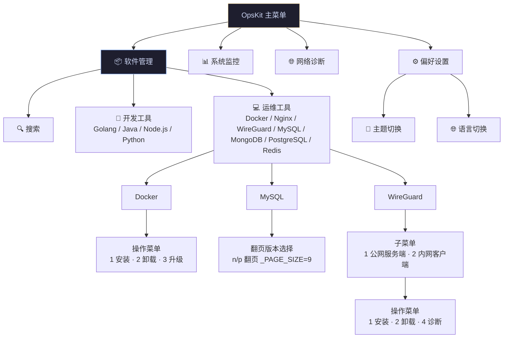
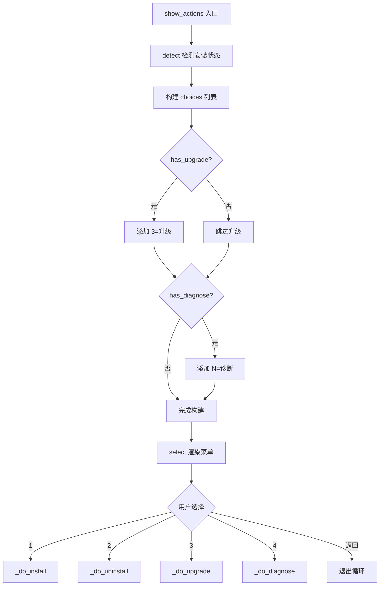

# 菜单与导航系统设计

> 所属主流程：[overview.md](overview.md) → 主菜单循环 + 软件管理模块

---

## 1. 设计目标

- 统一的面包屑导航，用户始终知道自己在哪一层
- 动态菜单构建：根据 Recipe 能力声明自动增减选项
- 固定编号（1=安装 2=卸载 3=升级），扩展从 4+ 开始
- 子菜单无限嵌套（目前两层：WireGuard → 公网/内网）

---

## 2. 导航层级



---

## 3. 菜单构建逻辑

### 3.1 主菜单（main.py → `_main_menu`）

```python
choices = [
    {"key": "1", "label": f"{get_icon(m.key)} {t(f'menu.{m.key}')}"}
    for i, m in enumerate(modules)
]
# 偏好设置始终最后一项
choices.append({"key": pref_key, "label": f"{get_icon('preferences')} {t('menu.preferences')}"})
```

菜单项由 `core/loader.py` 自动发现，按 `ModuleInfo.order` 排序。  
模块 `entry()` 抛出未捕获异常时，自动通过 `telemetry.capture_error` 上报并显示错误提示。

### 3.2 软件操作菜单（menu.py → `show_actions`）

**固定编号 + 动态扩展**：

| 编号 | 操作 | 条件 | 状态标记 |
|------|------|------|----------|
| 1 | 安装 | 始终显示 | 已安装时灰显 |
| 2 | 卸载 | 始终显示 | 未安装时灰显 |
| 3 | 升级 | `has_upgrade=True` | 未安装时灰显 |
| 4+ | 诊断 | `has_diagnose=True` | — |
| 4+ | 其他扩展 | 未来预留 | — |



### 3.3 子菜单分发（menu.py → `_show_submenu`）

当 Recipe 声明 `has_submenu=True` 时，`_pick_and_act` 检测到后不进入 `show_actions`，而是进入 `_show_submenu`：

```python
def _show_submenu(breadcrumb, cls):
    instance = cls()
    items = instance.submenu_items()
    # 渲染子菜单 → 用户选择 → 跳转到对应子 Recipe 的 show_actions
```

---

## 4. 面包屑导航

每个菜单层级通过 `breadcrumb: list[str]` 传递路径：

```
OpsKit → 软件管理 → 运维工具 → WireGuard → 公网服务端
```

`core/prompt.py` 的 `select()` 函数在面板顶部渲染面包屑。

---

## 5. UI 组件

### 5.1 select（单选菜单）

```python
select(
    breadcrumb=["OpsKit", "软件管理"],
    subtitle="请选择",
    choices=[{"key": "1", "label": "📦 Docker Engine"}],
    theme_key="software",        # 颜色主题
    back_label="🔙 返回",        # 返回键标签
)
```

- 数字键选择
- `0` / `q` / `ESC` 返回上层
- 返回 `key` 字符串或 `None`（返回）
- `UserCancel` 异常（Ctrl+C）

### 5.2 confirm（确认框）

```python
confirm("卸载 Docker？此操作不可恢复") -> bool
```

### 5.3 text_input（文本输入）

```python
text_input("请输入端口", default="3443") -> str
```

---

## 6. 主题集成

菜单颜色从 `catppuccin.yaml` 的 `colors.modules.{theme_key}` 读取：

```yaml
colors:
  modules:
    software:
      title: "bold #89b4fa"
      border: "#89b4fa"
      breadcrumb_bg: "#89b4fa"
      breadcrumb_fg: "#1e1e2e"
```

图标从 `icons.{key}` 读取，每个菜单项格式：`{icon} {i18n_label}`。

---

## 7. 模块注册协议

每个插件模块（`software/` / `monitor/` 等）在 `__init__.py` 中暴露 `register()` 函数：

```python
def register() -> ModuleInfo:
    return ModuleInfo(
        key="software",
        description_key="module.software.desc",
        order=100,
        entry=entry,
        platforms=["linux", "windows", "darwin"],
    )
```

`core/loader.py` 扫描所有顶层目录，调用 `register()` 收集 `ModuleInfo` 列表。

---

## 8. 搜索功能

软件管理模块顶层提供搜索入口：

```python
keyword = text_input(t("software.search_prompt"))
# 遍历所有已注册 Recipe
# 匹配 key / description / i18n 名称
# 显示匹配结果列表
```

搜索范围：`Recipe.key`、`Recipe.description`、`t(f"software.{key}")`。
