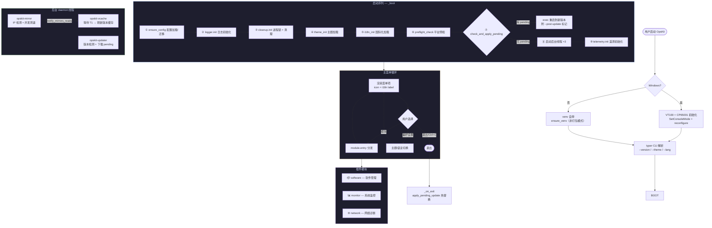
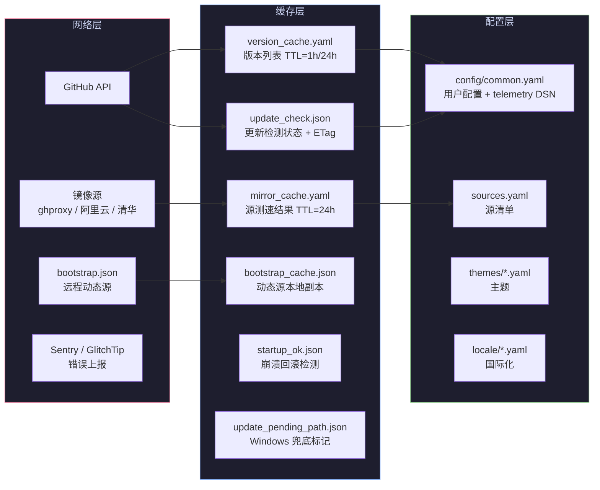

# OpsKit 架构总览

> 本文件是整个项目的**主流程设计图**，其他文档均为此流程中某个模块的详细设计。

---

## 1. 系统定位

OpsKit 是一个**跨平台 CLI 运维面板**，单二进制分发，支持 Linux / macOS / Windows。  
核心能力：一键安装软件、实时监控、服务管理、防火墙、网络诊断、安全加固、备份、日志分析。

当前版本：`APP_VERSION = 1`（`core/constants.py`）

---

## 2. 主流程图（Mermaid）



---

## 3. 核心模块索引

| 模块 | 文件 | 详细设计 | 说明 |
|------|------|----------|------|
| **启动与配置** | `main.py` / `core/config.py` | [bootstrap-and-config.md](bootstrap-and-config.md) | 启动序列、配置加载/迁移、路径双模式、venv 自举 |
| **自更新** | `core/updater.py` / `bootstrap.json` | [self-update.md](self-update.md) | bootstrap 拉取、版本检测、多源下载、Windows 四层热替换、崩溃回滚、telemetry 上报 |
| **源管理** | `core/mirror.py` / `core/version_cache.py` | [source-management.md](source-management.md) | IP 归属地检测、并发测速、版本缓存三级 TTL |
| **配方系统** | `software/base.py` / `software/registry.py` | [recipe-system.md](recipe-system.md) | Recipe 抽象基类、能力声明、子菜单、安装向导、翻页版本选择 |
| **菜单导航** | `software/menu.py` / `core/prompt.py` | [menu-system.md](menu-system.md) | 动态菜单构建、面包屑导航、子菜单分发 |

---

## 4. 目录结构

```
cli/
├── main.py                     # 入口：VT100 初始化 → venv 自举 → _boot → 主菜单循环
├── bootstrap.json              # 自更新动态源配置
├── _registry.py                # 打包模式静态注册表
│
├── core/                       # 框架层（所有模块共享）
│   ├── config.py               #   配置读写 + 迁移 + 路径双模式
│   ├── constants.py            #   全局常量（版本 / 超时 / 路径 / TTL / Bootstrap URLs）
│   ├── cleanup.py              #   进程锁 + 临时文件清理
│   ├── i18n.py                 #   国际化（zh / en，YAML 驱动）
│   ├── loader.py               #   模块自动发现（开发扫描 / 打包注册）
│   ├── logger.py               #   日志轮转（5MB × 3）
│   ├── mirror.py               #   智能源管理（IP 检测 / 测速 / 切源 / 断点续传）
│   ├── module.py               #   ModuleInfo 数据类
│   ├── platform.py             #   平台检测 + 预检
│   ├── privilege.py            #   权限提升
│   ├── progress.py             #   进度条渲染
│   ├── prompt.py               #   交互式 UI 组件（select / confirm / input）
│   ├── runner.py               #   子进程执行器
│   ├── theme.py                #   主题加载 + 切换
│   ├── updater.py              #   自更新（bootstrap / 检测 / 下载 / 热替换 / 回滚 / telemetry 上报）
│   ├── utils.py                #   通用工具函数
│   ├── venv_bootstrap.py       #   Linux/macOS venv 自举（打包模式跳过）
│   ├── version.py              #   版本号解析
│   ├── version_cache.py        #   版本缓存层（三级 TTL / 后台刷新）
│   ├── telemetry/              #   错误上报门面层
│   │   ├── __init__.py         #   init / capture_error / capture_message 公共 API
│   │   ├── base.py             #   TelemetryProvider 抽象接口
│   │   ├── sentry_provider.py  #   Sentry / GlitchTip 实现
│   │   └── null_provider.py    #   DSN 为空时静默
│   ├── locale/                 #   i18n 资源（zh.yaml / en.yaml）
│   ├── mirrors/                #   源清单（sources.yaml）
│   └── themes/                 #   主题文件（catppuccin.yaml）
│
├── software/                   # 软件管理模块
│   ├── __init__.py             #   register() 注册入口
│   ├── base.py                 #   Recipe 抽象基类
│   ├── menu.py                 #   菜单渲染 + 安装/卸载/升级/诊断/翻页版本选择
│   ├── registry.py             #   Recipe 注册表
│   └── recipes/                #   具体配方（每种软件一个子目录）
│       ├── docker/
│       ├── golang/
│       ├── java/
│       ├── nginx/
│       ├── nodejs/
│       ├── mongodb/
│       ├── mysql/
│       ├── postgresql/
│       ├── python/
│       └── redis/
│
├── wireguard/                  # WireGuard 核心逻辑
│   ├── constants.py            #   部署常量（端口 / 子网 / 路径）
│   ├── server.py               #   公网服务端安装/卸载/诊断
│   └── client.py               #   内网客户端安装/卸载/诊断
│
├── monitor/                    # 系统监控模块
├── network/                    # 网络诊断模块
└── tests/                      # 测试套件（pytest，仅 test_*.py）
```

---

## 5. 数据流概览



---

## 6. 线程模型

| 线程名 | 类型 | 生命周期 | 依赖 | 功能 |
|--------|------|----------|------|------|
| `main` | 主线程 | 全程 | — | UI 渲染 + 用户交互 |
| `opskit-mirror` | daemon | 启动 → 初始化完成 | — | IP 检测 + 并发测速 + 写入缓存 |
| `opskit-vcache` | daemon | 等待 mirror → 刷新完成 | mirror | 串行刷新每个 Recipe 的版本列表 |
| `opskit-updater` | daemon | 启动 → 检测/下载完成 | — | OpsKit 自身版本检测 + 下载到 pending |

**同步机制**：`opskit-vcache` 通过 `threading.Event`（`_refresh_event`）等待 `opskit-mirror` 完成后开始工作。

---

## 7. 设计原则

- **单二进制分发**：Nuitka / PyInstaller 打包，`_registry.py` 静态注册避免运行时扫描
- **双模式路径**：开发模式用项目目录，打包模式用系统数据目录
- **只增不删配置迁移**：新版本只添加默认值，不删除用户自定义字段
- **三级兜底**：在线 API → 本地缓存 → 硬编码回退
- **后台不阻塞**：网络操作全部 daemon 线程，主线程即时渲染
- **原子写入**：缓存文件先写 `.tmp` 再 `replace`，防止断电损坏
- **全面上报**：更新流程所有失败点接入 telemetry，携带平台/版本/路径等诊断上下文
- **Windows 四层防御**：PS 脚本 → 跨驱动器 copy2 → MoveFileEx → update_pending_path.json 兜底
