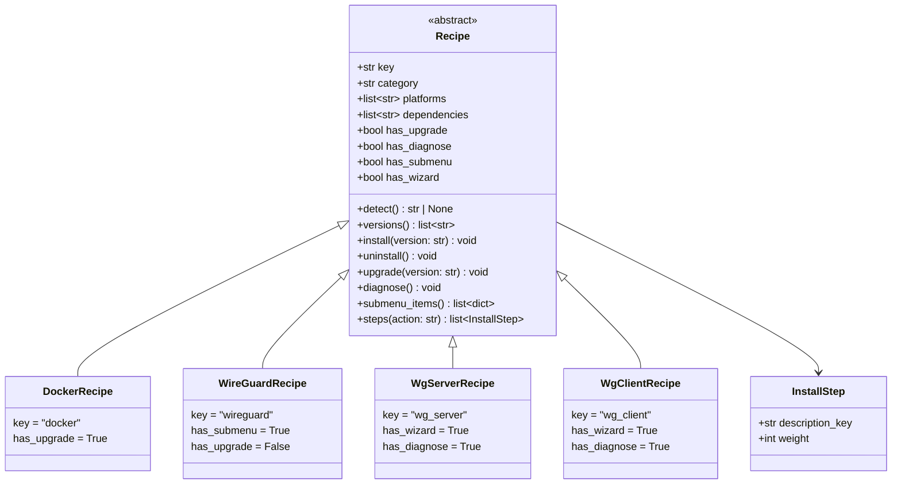
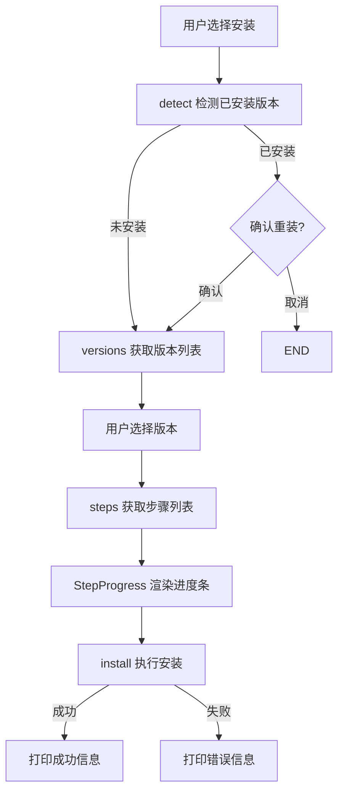
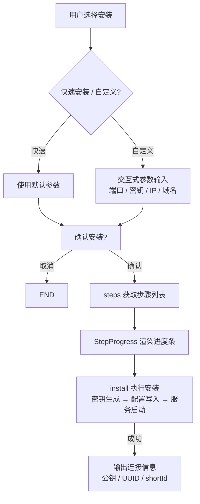
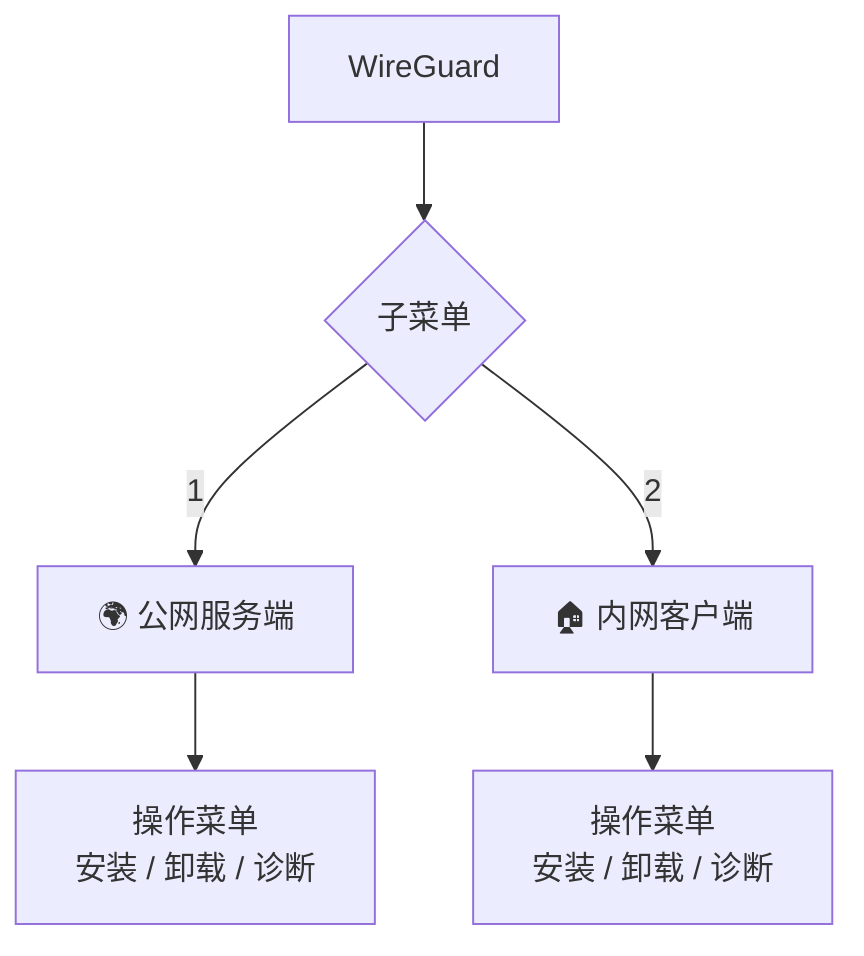

# Recipe 配方系统设计

> 所属主流程：[overview.md](overview.md) → 软件管理模块（software/）

---

## 1. 设计目标

- 每种软件一个 Recipe 类，声明式定义能力，框架层统一调度
- 能力标记驱动菜单生成（升级 / 诊断 / 子菜单 / 向导）
- 支持层级配方（WireGuard → 公网服务端 / 内网客户端）
- 安装 / 卸载 / 升级 / 诊断流程可复用，进度条自动渲染

---

## 2. 类图



---

## 3. 能力声明字段

| 字段 | 默认值 | 作用 | 影响 |
|------|--------|------|------|
| `has_upgrade` | `True` | 是否支持升级 | 菜单中显示/隐藏升级选项 |
| `has_diagnose` | `False` | 是否支持诊断 | 菜单 4+ 位置添加诊断入口 |
| `has_submenu` | `False` | 是否有子菜单 | 选中后进入子菜单而非操作菜单 |
| `has_wizard` | `False` | 是否使用安装向导 | 安装时调用 Recipe 自定义流程而非通用流程 |
| `has_version_picker` | `False` | 是否启用翻页版本选择 | 版本列表超 9 项时翻页（_PAGE_SIZE=9），走 `_do_install_version_picker` 流程 |

### 能力组合示例

| 配方 | 支持升级 | 支持诊断 | 有子菜单 | 安装向导 | 翻页选版本 | 说明 |
|------|---------|---------|---------|--------|-----------|------|
| Docker | ✅ | ❌ | ❌ | ❌ | ❌ | 标准软件，版本数少 |
| Nginx | ✅ | ❌ | ❌ | ❌ | ❌ | 标准软件 |
| Golang | ✅ | ❌ | ❌ | ❌ | ✅ | 版本多（需翻页） |
| Java | ✅ | ❌ | ❌ | ❌ | ✅ | 版本多（需翻页） |
| Node.js | ✅ | ❌ | ❌ | ❌ | ✅ | 版本多（需翻页） |
| MySQL | ✅ | ❌ | ❌ | ❌ | ✅ | 版本多（需翻页） |
| MongoDB | ✅ | ❌ | ❌ | ❌ | ✅ | 版本多（需翻页） |
| PostgreSQL | ✅ | ❌ | ❌ | ❌ | ✅ | 版本多（需翻页） |
| Redis | ✅ | ❌ | ❌ | ❌ | ✅ | 版本多（需翻页） |
| WireGuard | ❌ | ❌ | ✅ | ❌ | ❌ | 父级容器，无实际安装逻辑 |
| WG Server | ❌ | ✅ | ❌ | ✅ | ❌ | 交互式向导 + 诊断 |
| WG Client | ❌ | ✅ | ❌ | ✅ | ❌ | 交互式向导 + 诊断 |

> **规则**：所有版本列表可能超过 9 项的 Recipe 必须设置 `has_version_picker=True`。

---

## 4. 注册机制

### 4.1 注册表（registry.py）

```python
_registry: dict[str, type[Recipe]] = {}

def register(cls: type[Recipe]) -> None:
    _registry[cls.key] = cls

def get(key: str) -> type[Recipe] | None:
    return _registry.get(key)

def all_recipes() -> list[type[Recipe]]:
    return list(_registry.values())
```

### 4.2 自动发现

`software/recipes/` 目录下的每个 `.py` 文件在 import 时自动注册。  
模块加载顺序由 `software/__init__.py` 控制。

---

## 5. 版本获取策略

每个 Recipe 通过属性声明版本获取方式：

```python
class DockerRecipe(Recipe):
    version_source = "github_api"
    version_source_key = "moby/moby"
```

详见 [source-management.md](source-management.md) → 版本源类型。

版本获取优先级：

```
版本缓存（< 1h）→ 版本缓存（1h~24h，后台刷新）→ 在线 API → 硬编码 fallback_versions
```

---

## 6. 安装流程

### 6.1 标准安装（has_wizard=False）



### 6.2 向导安装（has_wizard=True）



---

## 7. 子菜单机制

当 `has_submenu=True` 时，选中该 Recipe 后不进入操作菜单，而是渲染子菜单：



`submenu_items()` 返回格式：

```python
[
    {"key": "wg_server", "label_key": "software.wg_server"},
    {"key": "wg_client", "label_key": "software.wg_client"},
]
```

---

## 8. 诊断机制

当 `has_diagnose=True` 时，操作菜单中 4 号位出现诊断入口。

诊断内容由子类 `diagnose()` 实现，典型检查项：

| 检查项 | 说明 |
|--------|------|
| 服务状态 | `systemctl is-active wg-quick@wg0` |
| 端口监听 | `ss -tlnp | grep :3443` |
| 配置文件 | 检查 `/etc/wireguard/wg0.conf` 是否存在 |
| 网络连通 | `ping -c 1 10.0.0.1` |
| 接口状态 | `wg show wg0` |

---

## 9. 进度条集成

```python
steps = recipe.steps("install")  # 获取步骤列表
with StepProgress(steps) as sp:
    sp.advance("正在下载...")      # 推进一步
    recipe.install(version)
    sp.advance("正在验证...")
```

`InstallStep.weight` 控制该步骤在进度条中占的比例。

---

## 10. WireGuard 配方架构

```
software/recipes/
├── wireguard.py        # 父级 Recipe：has_submenu=True
├── wg_server.py        # 公网服务端 Recipe
└── wg_client.py        # 内网客户端 Recipe

wireguard/              # 核心逻辑（与 Recipe 解耦）
├── constants.py        # 端口 / 子网 / 路径常量
├── utils.py            # 密钥生成 / 服务管理
├── templates.py        # xray + WireGuard 配置模板
├── server.py           # 服务端安装/卸载/诊断
└── client.py           # 客户端安装/卸载/诊断
```

**分层原则**：`software/recipes/wg_*.py` 只做 UI 交互和流程编排，`wireguard/*.py` 封装所有系统操作。
