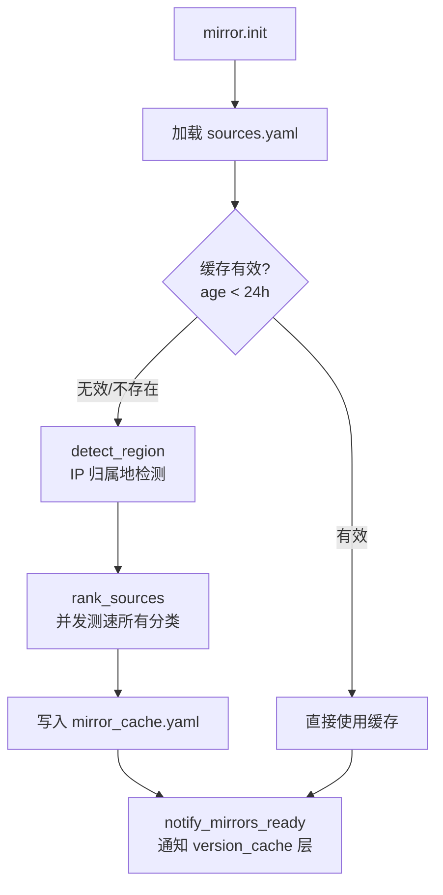
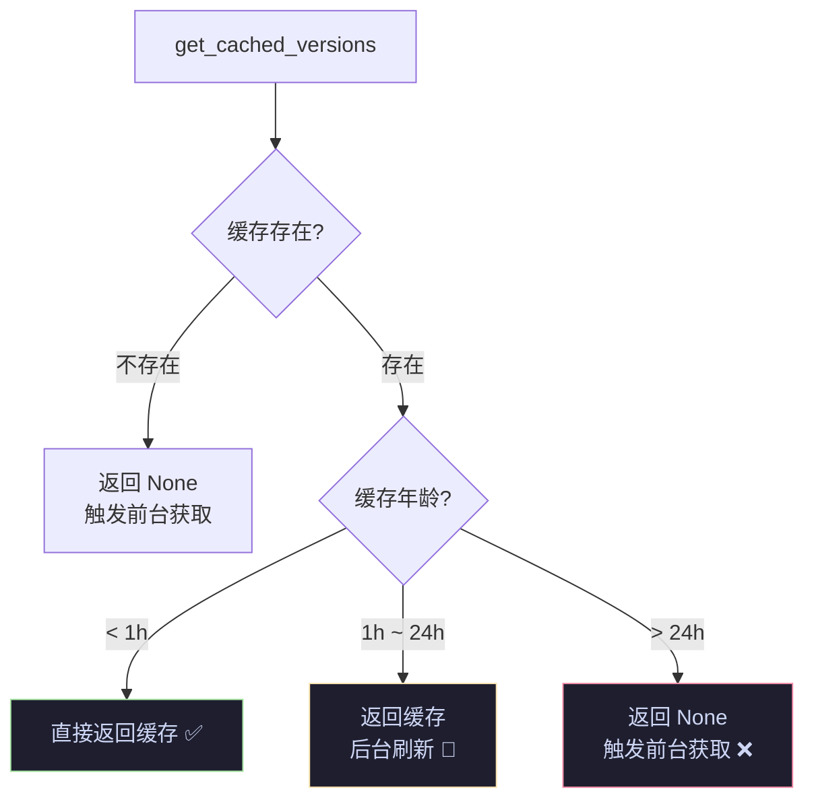
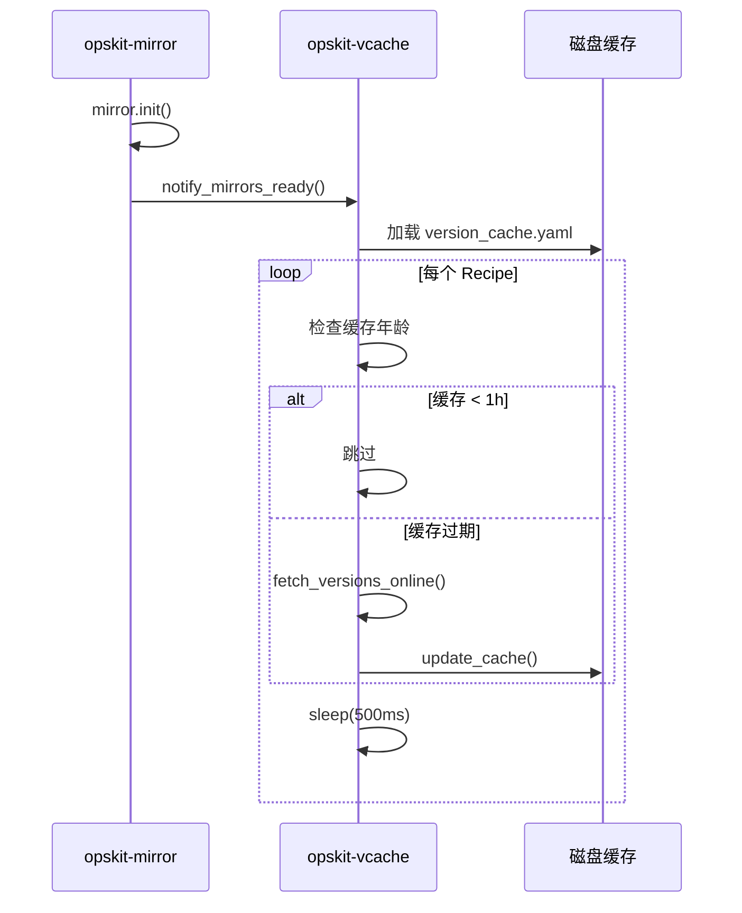

# 源管理与版本缓存设计

> 所属主流程：[overview.md](overview.md) → 后台线程 1（mirror）+ 后台线程 2（version_cache）

---

## 1. 设计目标

- 中国大陆用户自动切换国内镜像源，海外用户直连官方源
- 并发测速选最优源，24h 缓存避免重复测速
- 软件版本列表后台静默刷新，不阻塞 UI
- 三级兜底：在线 API → 本地缓存（含过期数据）→ 硬编码回退

---

## 2. 源管理层（mirror.py）

### 2.1 初始化流程



### 2.2 IP 归属地检测

**API 优先级链**（依次尝试，任一成功即停止）：

| 顺序 | API | 提取字段 |
|------|-----|----------|
| 1 | `ipinfo.io/json` | `country` |
| 2 | `ipapi.co/json/` | `country_code` |
| 3 | `ip-api.com/json/` | `countryCode` |

- 返回 `CN` → `"cn"`
- 返回其他国家 → `"global"`
- 全部失败 → 兜底 `"global"`
- 用户可在配置中覆盖：`mirror.region: cn` / `global` / `auto`

### 2.3 并发测速

```python
rank_sources(category, region, sources) -> list[str]
```

- 优先当前地区源，追加其他地区源
- `ThreadPoolExecutor(max_workers=8)` 并发 HEAD 请求（超时 `TIMEOUT_MIRROR_PROBE=5s`）
- 按延迟升序排序，过滤不可达源
- 最多返回 `MIRROR_PROBE_COUNT`（3）个源

### 2.4 源分类

| 分类 | 用途 | 测速路径 |
|------|------|----------|
| `pip` | Python 包管理 | `/simple/` |
| `docker` | Docker 镜像 | `/v2/` |
| `apt` | Ubuntu/Debian 包 | `/ubuntu/` |
| `yum` | CentOS/RHEL 包 | `/centos/` |
| `brew` | macOS Homebrew | `/` |
| `github_releases` | OpsKit 自更新 + 软件下载 | `/` |
| `version_api.*` | 版本查询 API（不测速） | — |

### 2.5 多源下载

```python
mirror.download(url_template, dest, category, progress_callback, total_size)
```

- `url_template` 含 `{mirror}` 占位符
- 自动切源：失败后轮换到下一个源
- 断点续传：检查已下载字节，发送 `Range` 头
- 最多 `MAX_RETRY_DOWNLOAD`（3）次重试

---

## 3. 版本缓存层（version_cache.py）

### 3.1 三级 TTL 策略



| 年龄 | 行为 | 用户体验 |
|------|------|----------|
| < 1h | 直接返回缓存 | 即时显示 |
| 1h ~ 24h | 返回旧数据，后台静默刷新 | 即时显示（可能稍旧） |
| > 24h | 返回 None，前台在线获取 | 短暂等待 |

### 3.2 版本源类型

Recipe 通过 `version_source` 属性声明版本获取方式：

| 类型 | 示例 | API |
|------|------|-----|
| `github_api` | Docker / Nginx | `api.github.com/repos/{repo}/releases` |
| `endoflife` | Node.js / Python | `endoflife.date/api/{product}.json` |
| `custom_api` | 自定义 URL | Recipe 自定义 `parse_versions()` |
| `none` | WireGuard | 不获取版本，返回 `["latest"]` |

### 3.3 后台刷新线程



**关键设计**：
- 等待 `_refresh_event`（最多 15s），确保源管理层就绪
- 串行刷新（非并发），每个 Recipe 间隔 500ms，避免触发 API 速率限制
- 获取失败时保留旧缓存，不清空

### 3.4 原子写入

```python
def _save_cache(data):
    tmp = path.with_suffix(".tmp")
    yaml.dump(data, tmp)
    tmp.replace(path)  # 原子替换
```

防止断电 / 进程被杀导致缓存文件损坏。读取时检测到损坏文件自动删除。

---

## 4. sources.yaml 结构

```yaml
# 按分类 → 按地区 → 源列表
pip:
  cn:
    - url: https://mirrors.aliyun.com/pypi/simple/
      name: 阿里云
  global:
    - url: https://pypi.org/simple/
      name: PyPI

# 版本查询 API（嵌套结构）
version_api:
  github:
    cn:
      - url: https://mirror.ghproxy.com/https://api.github.com
    global:
      - url: https://api.github.com
  endoflife:
    global:
      - url: https://endoflife.date/api

# 测速探针
probe:
  pip:
    path: /simple/
```

---

## 5. 文件路径

| 文件 | 路径 | TTL | 说明 |
|------|------|-----|------|
| 源清单 | `core/mirrors/sources.yaml` | 随代码更新 | 所有镜像源定义 |
| 测速缓存 | `{data}/cache/mirror_cache.yaml` | 24h | 已排序的源列表 + 地区 |
| 版本缓存 | `{data}/cache/version_cache.yaml` | 1h/24h | 每个 Recipe 的版本列表 |

---

## 6. 常量（来自 `core/constants.py`）

| 常量 | 值 | 说明 |
|------|-----|------|
| `MIRROR_CACHE_TTL` | 86400 | 源测速缓存有效期（24h） |
| `MIRROR_PROBE_COUNT` | 3 | 最多保留的可达源数量 |
| `TIMEOUT_MIRROR_PROBE` | 5 | 单源测速超时（秒） |
| `VERSION_CACHE_TTL` | 3600 | 版本缓存新鲜期（1h） |
| `VERSION_CACHE_STALE_TTL` | 86400 | 版本缓存完全过期（24h） |
| `VERSION_FETCH_TIMEOUT` | 10 | 在线版本获取超时（秒，后台宽松） |
| `VERSION_FETCH_INTERVAL` | 500 | 后台串行刷新间隔（ms） |
| `MAX_RETRY_DOWNLOAD` | 5 | 下载最大重试次数 |
| `DOWNLOAD_RETRY_BASE_DELAY` | 1 | 指数退避基数（秒），第 n 次失败等 2^(n-1)s |
| `TIMEOUT_STALL_SECS` | 30 | 下载 stall 超时（秒），无新数据则切源 |
